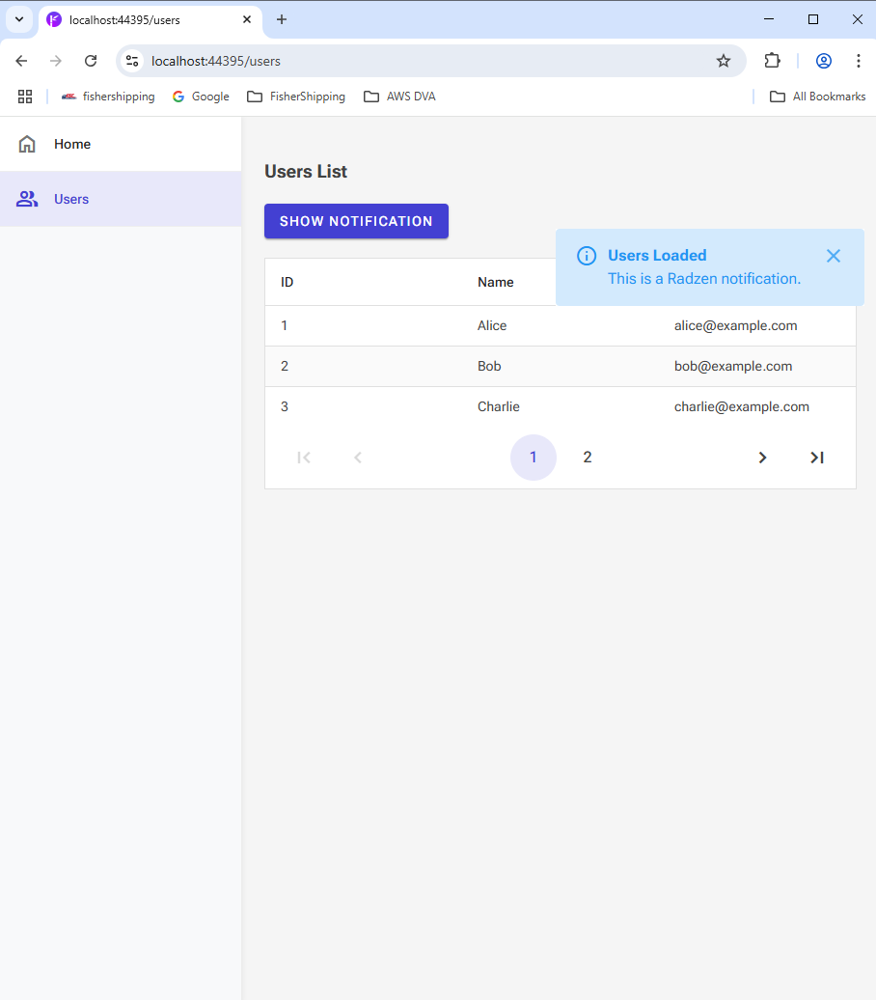

# ✅ Radzen Blazor VSIX Template Application - Proof of Concept
This repository presents a fully functional Proof of Concept (PoC) for a modular Blazor Server application built using the Radzen Blazor VSIX Template. It showcases how to scaffold and extend Blazor apps using Radzen’s rich component library and project structure.


### Tested On

This PoC has been tested on the following environment:

| Tool/Framework       | Version                |
| -------------------- | ---------------------- |
| .NET SDK             | .NET 9 (Preview)       |
| Blazor               | Server-side Blazor     |
| Visual Studio        | 2022 (latest version)  |
| Radzen.Blazor NuGet  | Latest                 |
| Radzen VSIX Template | Trial version used     |

You can try the [Radzen Blazor Studio VSIX Extension](https://marketplace.visualstudio.com/) from the Visual Studio Marketplace.


# 📋 Prerequisites

### Tools Required
- Visual Studio 2022 (latest version recommended)
- .NET 9 SDK (or the version specified in the project)
- Radzen Blazor Components (installed via NuGet)
- Radzen Blazor Studio VSIX Extension (installed in Visual Studio)
- Git (for version control)

### Radzen Blazor Studio VSIX Extension
- Download from Radzen Marketplace

### Environment Requirements
- Internet access (for restoring NuGet packages and using Radzen CDN)
- (Optional) SQL Server or other database if the PoC includes data access

### HTTPS Development Certificate
- dotnet dev-certs https --trust (if needed)

###  Run the Application (Cross-platform CLI)

# git clone https://github.com/DevalPatelDevloper/RadzenBlazorApplication.git/RadzenBlazorApplication.git
# cd RadzenBlazorApplication
# dotnet restore
# dotnet build
# dotnet run


### 📌 What the PoC Is About

The RadzenBlazorApplication PoC demonstrates:
 - How to scaffold a complete UI with Radzen’s VSIX template
 - Integration of Radzen Blazor components (e.g., DataGrid, Dialog, Chart)
 - Structured layout, navigation, and responsive design
 - Modular folder structure for pages, services, and models

### 🧭 When and Why to Use This Template
## ✅ Use this template when:
- You want to quickly start a Blazor Server project with Radzen components
- You're building an internal dashboard, reporting tool, or admin portal
- You prefer drag-and-drop UI development and rapid scaffolding

### ❌ Avoid this template when:
- You require Blazor WebAssembly
- You need tight control over raw Razor markup or a custom UI stack

### 🛠 How to Implement the Solution

### Step 1: Install Radzen Template
- Install Radzen Blazor Studio VSIX Extension from Visual Studio Marketplace [Trail]
- Restart Visual Studio after installation

### Step 2: Create the Project
- Open Visual Studio > Create New Project
- Select Radzen Blazor App
- Choose project name, location, and target framework (.NET 9 recommended)
- Disable Docker, choose “No Authentication” (or as per your requirements)

### Step 3: Restore Dependencies
- Right-click solution > Restore NuGet Packages

### Step 4: Run the Application
- Use F5 or CLI (dotnet run) to launch the app

The default Radzen layout and navigation will load

### ⚙ Required Configuration Details

### appsettings.json:
- Configure connection strings and APIs if your app accesses backend services

### Routing:
- Use @page directive in .razor files to define custom routes

### NuGet:
- Ensure Radzen.Blazor is added to the project references

### 💡 Use Cases

### 1. Internal Dashboard
- Display KPIs, data tables, and charts using Radzen components

### 2. Customer Portal
- Build secure user interfaces with navigation, forms, and role-based views

### 3. Reporting System
- Integrate charts, downloadable reports, and filterable grids


### Demo – UI Snapshots & Interaction  
🔹 Home Page  


🔹 Users Page with Notification  
  

🔹 Users DataGrid with Paging  
  


### 🧯 Troubleshooting Steps

### Problem	Solution

| Problem                         | Solution                                                              |
| ------------------------------- | --------------------------------------------------------------------- |
| Template not visible            | Make sure VSIX extension is installed and restart Visual Studio       |
| Radzen components not rendering | Add `@using Radzen` and `@using Radzen.Blazor` to `_Imports.razor`    |
| Layout or style issues          | Check for missing layout files or CSS in `_Host.cshtml`               |
| Build errors                    | Restore packages and clean the solution                               |
| Notification not working        | Add `<RadzenNotification />` in layout or page and inject the service |                            |


### 📁 Project Structure
```
/RadzenBlazorApplication
│
├── /Pages              → Razor pages for UI
├── /Shared             → Layouts, NavMenu, MainLayout
├── /Services           → Business logic or API access
├── /Models             → Data models
├── Program.cs          → App setup and DI
├── appsettings.json    → Environment configs
```

## 📚 Additional Resources

- [Radzen Blazor Components Docs](https://blazor.radzen.com/)
- [Radzen YouTube Tutorials](https://www.youtube.com/c/Radzen)
- [Radzen Forum](https://forum.radzen.com/)

### 🧾 Summary
This PoC demonstrates how to rapidly build a scalable, responsive Blazor Server application using the Radzen Blazor Studio VSIX Template and Radzen’s component library. Perfect for dashboards, admin tools, and internal web portals.

💬 Try out Radzen Blazor Studio VSIX (Trial) to experience low-code Blazor development.
